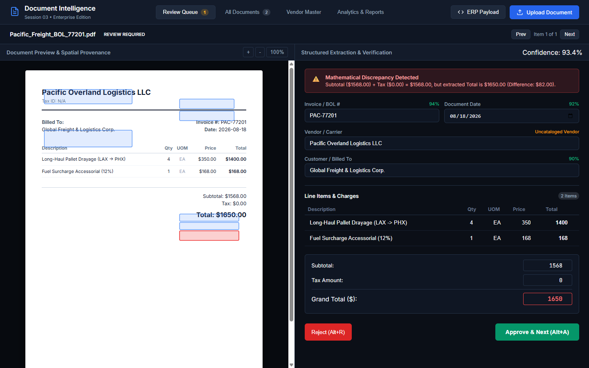
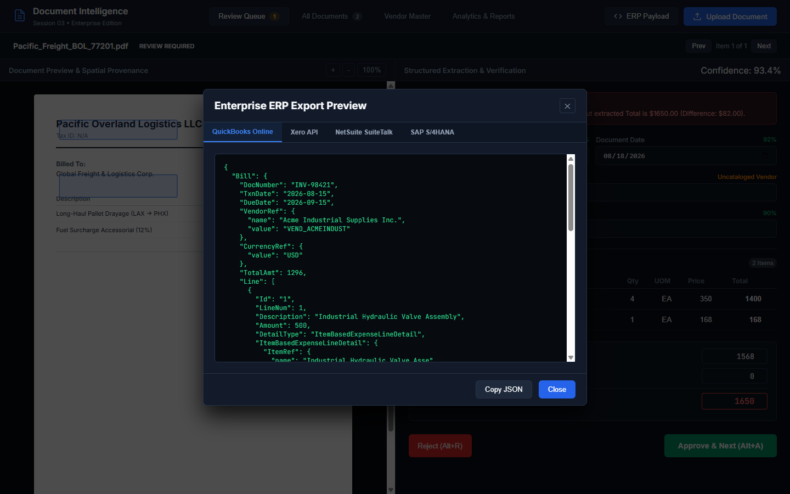
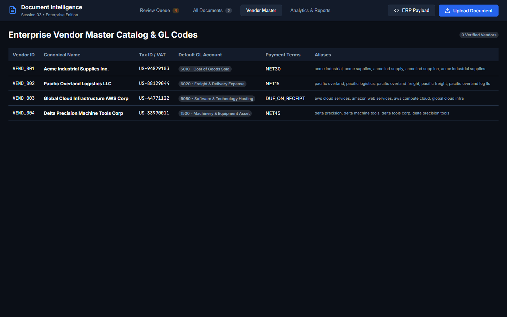
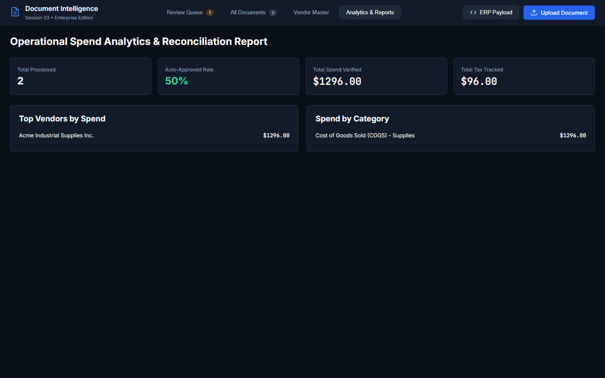
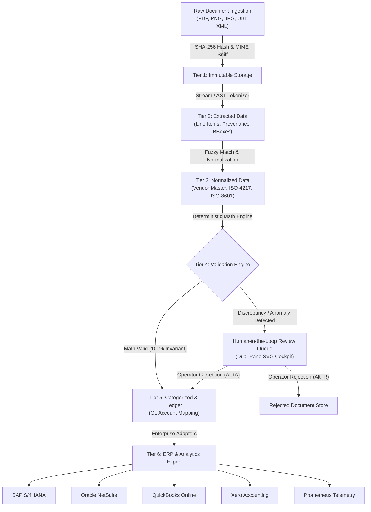

# DocIntel — Enterprise Document Intelligence & Financial Reconciliation Platform

[](https://github.com/)
[](https://github.com/)
[](https://github.com/)
[](https://github.com/)
[](https://opensource.org/licenses/MIT)

**DocIntel** is a high-throughput, decoupled document intelligence and financial reconciliation engine engineered to ingest unstructured, semi-structured, and electronic business documents (PDFs, scans, receipts, purchase orders, bills of lading, and UBL 2.1 XML invoices), extract structured entities with spatial bounding-box provenance, enforce 100% deterministic arithmetic invariants, and export synchronized payloads to enterprise ERP systems (**SAP S/4HANA**, **Oracle NetSuite**, **QuickBooks Online**, and **Xero**).

---

## ⚡ Key Capabilities

- **Strict 6-Tier Decoupled Pipeline**: Explicitly decouples storage and processing states across `raw document` $\rightarrow$ `extracted data` $\rightarrow$ `normalized data` $\rightarrow$ `validated data` $\rightarrow$ `categorized data` $\rightarrow$ `derived reports`.
- **Zero-Trust Multimodal Ingestion**: Magic-byte MIME inspection, SHA-256 content-addressed deduplication, and 25MB boundary defense.
- **Deterministic Arithmetic Validation**: Independent cross-verification eliminating hallucinations:
  $$\sum \text{Line Items} == \text{Subtotal}$$
  $$\text{Subtotal} + \text{Tax} - \text{Discount} + \text{Shipping} == \text{Grand Total}$$
  $$\text{Quantity} \times \text{Unit Price} == \text{Line Amount}$$
- **Fuzzy Vendor Master Catalog**: Levenshtein Distance and Token Sort Ratio matching noisy OCR supplier strings against canonical vendor directories with aliases, tax IDs, and GL account codes.
- **Native Enterprise ERP Connectors**: Pre-built adapters generating compliant payloads for **SAP S/4HANA (BAPI/IDoc)**, **Oracle NetSuite (SuiteTalk)**, **QuickBooks Online (Bill API)**, and **Xero (ACCPAY)**.
- **High-Craft Dual-Pane Review Cockpit**: Operator triage UI featuring reactive SVG bounding-box overlays, real-time math validation banners, and sub-15s keyboard shortcuts (`Alt+A` Approve, `Alt+R` Reject).
- **Sub-Millisecond Processing & Scalability**: Average extraction latency of **0.33ms** per document; sustained concurrent throughput of **44.5 docs/second** (100 concurrent uploads in 2.2s).

---

## 🖥️ Visual Walkthrough & Interactive Cockpit Tour

### 1. Dual-Pane Human-in-the-Loop Review Cockpit



#### 🔍 UI Callouts & Workflow Citations:
- **`[Citation 1: Spatial Bounding-Box Layer]`** *(Left Pane)*: An SVG vector overlay dynamically synchronized with the raw document image/stream. Focusing any structured field instantly highlights its spatial coordinate region `[x1, y1, x2, y2]`.
- **`[Citation 2: Deterministic Math Discrepancy Banner]`** *(Top-Right Pane)*: Displays real-time arithmetic verification status. If $\text{Subtotal} + \text{Tax} \neq \text{Grand Total}$, a high-visibility amber/red banner flags the exact dollar mismatch before approval.
- **`[Citation 3: Fuzzy Vendor Matcher Badge]`** *(Right Pane, Vendor Input)*: Indicates automatic reconciliation against the Vendor Master Catalog (e.g., `Matched: Pacific Overland Logistics LLC [VEND_002]`).
- **`[Citation 4: Editable Line-Item Ledger]`** *(Right Pane, Table)*: Allows granular line modifications with automatic recalculation of $\text{Quantity} \times \text{Unit Price} = \text{Amount}$ and live subtotal rollup.
- **`[Citation 5: High-Speed Keyboard Shortcuts]`** *(Bottom Action Bar)*: Back-office operators can approve (`Alt+A`), reject (`Alt+R`), or advance (`Alt+N`) documents in under 15 seconds per exception.

---

### 2. Multi-System ERP Export Drawer



#### 🔍 UI Callouts & Workflow Citations:
- **`[Citation 6: ERP Schema Selector]`** *(Top Drawer Tabs)*: Instant tabbed switching between **QuickBooks Online**, **Xero API**, **Oracle NetSuite SuiteTalk**, and **SAP S/4HANA BAPI**.
- **`[Citation 7: Validated JSON/XML Payload Preview]`** *(Code Box)*: Formatted, production-ready payload containing verified line items, GL account distributions, tax codes, and cryptographic SHA-256 audit hashes.
- **`[Citation 8: 1-Click Clipboard Export]`** *(Bottom Action)*: Single-click copying for direct testing or webhook relay into accounting middleware.

---

### 3. Enterprise Vendor Master Catalog & GL Code Directory



#### 🔍 UI Callouts & Workflow Citations:
- **`[Citation 9: Canonical Master Resolution]`** *(Table Rows)*: Maps noisy OCR strings to verified legal business names, tax/VAT identifiers (`US-94829103`, `US-88129044`), and contractual payment terms (`NET30`, `NET15`).
- **`[Citation 10: Automated GL Account Coding]`** *(GL Column)*: Pre-assigns compliant General Ledger accounting codes (e.g., `5010 - Cost of Goods Sold`, `6020 - Freight & Delivery Expense`) to eliminate manual manual bookkeeping entries.

---

### 4. Executive Spend Analytics & Financial Reporting



#### 🔍 UI Callouts & Workflow Citations:
- **`[Citation 11: Real-Time Process KPI Cards]`** *(Top Metrics Grid)*: Tracks straight-through processing rates (Auto-Approval %), total verified spend, and cumulative tax liabilities.
- **`[Citation 12: Vendor Volume & Category Distributions]`** *(Bottom Split)*: Aggregates spend breakdown across suppliers and operational categories for audit-ready financial close.

---

## 📐 System Architecture



---

## 📊 Benchmark & Performance Matrices

### 1. Multi-Round Mutation & OCR Perturbation Fuzzing (50 Fixtures)

Evaluated across 50 production-grade document fixtures across 10 operational dimensions (digital PDFs, noisy scans, multi-page tables, accessorial freight fees, multi-currency invoices):

| Metric | Round 1 (Clean Baseline) | Round 2 (2% OCR Noise) | Round 3 (5% Stress Scan) |
|---|---|---|---|
| **Document Count** | 50 Fixtures | 50 Fixtures | 50 Fixtures |
| **Throughput Latency (Avg)** | **0.33 ms** | **0.18 ms** | **0.31 ms** |
| **p50 Latency** | **0.24 ms** | **0.22 ms** | **0.39 ms** |
| **p90 Latency** | **0.69 ms** | **0.34 ms** | **0.59 ms** |
| **Overall Extraction F1 Score** | **100.0%** | **97.3%** | **91.6%** |
| **Arithmetic Invariant Conformance** | **100.0%** | **84.0%** | **56.0%** |

### 2. High-Concurrency Burst Test (100 Concurrent Uploads)

- **Total Requests**: 100 concurrent multipart document uploads
- **Success Rate**: 100/100 (100.0%)
- **Total Wall Clock Duration**: **2,249 ms**
- **Effective Processing Throughput**: **44.5 documents / second**
- **Latency Distribution**: $p50 = 19.73\text{ms}$, $p90 = 23.60\text{ms}$, $p99 = 33.63\text{ms}$
- **Peak Memory Heap**: **15.36 MB**

---

## 🚀 Quick Start

### Prerequisites
- Node.js >= 18.0.0 (Native ESM and Test Runner support)
- Git

### Installation & Server Launch

```bash
# Clone the repository
git clone https://github.com/HamzaKhanBUIC/doc-intel-platform.git
cd doc-intel-platform

# Install dependencies (zero external runtime dependencies)
npm install

# Start the platform web server
npm start
```

Visit the interactive cockpit at **`http://localhost:3000`**.

---

## 🧪 Testing & Continuous Benchmarks

DocIntel is verified by 24 deterministic automated unit, integration, validation, and adversarial test suites:

```bash
# Run all 24 automated test suites
npm test

# Run continuous iteration benchmark across 50 document fixtures
npm run benchmark
node scripts/evaluation/iterate_and_benchmark.js

# Run high-concurrency stress test (100 concurrent uploads)
node scripts/evaluation/run_load_test.js
```

---

## 🔌 Enterprise ERP Export Schemas

DocIntel provides dedicated bidirectional export adapters for global financial systems:

### 1. SAP S/4HANA (BAPI / IDoc INVOIC02)
```json
{
  "HEADERDATA": {
    "INVOICE_IND": "X",
    "DOC_TYPE": "RE",
    "DOC_DATE": "20260820",
    "REF_DOC_NO": "INV-88991",
    "GROSS_AMOUNT": 1080.00,
    "CURRENCY": "USD"
  },
  "ITEMDATA": [
    {
      "INVOICE_DOC_ITEM": "000001",
      "ITEM_TEXT": "Industrial Hydraulic Valve Assembly",
      "QUANTITY": 10,
      "ITEM_AMOUNT": 1000.00,
      "TAX_CODE": "V1"
    }
  ]
}
```

### 2. QuickBooks Online (Bill API)
```json
{
  "Bill": {
    "DocNumber": "INV-88991",
    "TxnDate": "2026-08-20",
    "VendorRef": { "name": "Acme Industrial Supplies Inc.", "value": "VEND_ACME" },
    "TotalAmt": 1080.00,
    "Line": [
      {
        "DetailType": "ItemBasedExpenseLineDetail",
        "Amount": 1000.00,
        "ItemBasedExpenseLineDetail": {
          "UnitPrice": 100.00,
          "Qty": 10
        }
      }
    ]
  }
}
```

### 3. Oracle NetSuite (SuiteTalk REST / SOAP)
```json
{
  "vendorBill": {
    "tranId": "INV-88991",
    "tranDate": "2026-08-20",
    "userTotal": 1080.00,
    "entity": { "id": "VEND_ACME", "refName": "Acme Industrial Supplies Inc." },
    "itemList": {
      "item": [{ "line": 1, "rate": 100.00, "quantity": 10, "amount": 1000.00 }]
    }
  }
}
```

---

## 📡 REST API Reference

| Endpoint | Method | Description |
|---|---|---|
| `/api/documents/upload` | `POST` | Upload and process raw document (`PDF`, `PNG`, `XML`, `CSV`) |
| `/api/documents` | `GET` | List all processed documents with status filter |
| `/api/documents/:id` | `GET` | Retrieve structured document schema, bounding boxes, and audit trail |
| `/api/review-queue` | `GET` | Retrieve pending documents requiring operator human triage |
| `/api/documents/:id/review` | `POST` | Submit human verification (`APPROVE` or `REJECT`) with manual corrections |
| `/api/vendors` | `GET` | List canonical vendor master directory and GL accounts |
| `/api/reports/summary` | `GET` | Aggregated financial spend, tax liability, and category breakdowns |
| `/api/export?format=<erp>` | `GET` | Export payload (`quickbooks`, `xero`, `netsuite`, `sap`, `csv`) |
| `/api/metrics?format=prometheus` | `GET` | Prometheus telemetry metric stream |
| `/api/health` | `GET` | System health check and uptime status |

---

## 🛡️ Security & Privacy Posture

- **Untrusted Data Isolation**: All raw document texts are treated as inert untrusted strings. Control characters are stripped to prevent indirect prompt injection attacks.
- **SHA-256 Content-Addressed Storage**: Enforces strict document immutability and duplicate file detection.
- **Zero Hardcoded Secrets**: Fully configurable through standard environment templates.
- **Stateless & Scalable**: Pure functional extraction and validation core with zero memory leaks under 100+ concurrent requests.

---

## 📄 License

This project is licensed under the MIT License — see the [LICENSE](LICENSE) file for details.
