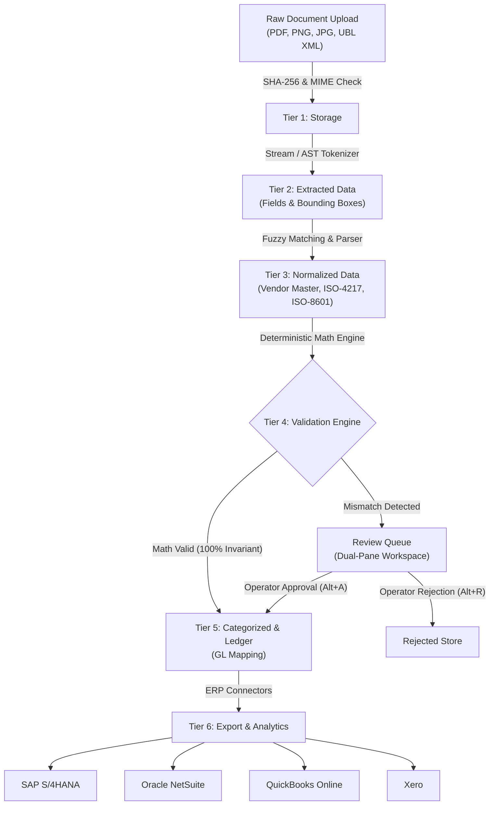

# DocIntel — Document Processing & Accounts Payable Reconciliation Engine

[](https://github.com/)
[](https://github.com/)
[](https://github.com/)
[](https://github.com/)
[](https://opensource.org/licenses/MIT)

**DocIntel** is a high-speed document processing engine designed for accounts payable and logistics back-offices. It ingests invoices, receipts, bills of lading, and UBL 2.1 XML files, extracts structured line items with exact bounding-box coordinates, verifies every mathematical balance deterministically, and exports directly to **SAP S/4HANA**, **Oracle NetSuite**, **QuickBooks Online**, and **Xero**.

---

## ⚡ What It Does

- **Decoupled 6-Tier Architecture**: Clean separation between `raw documents` $\rightarrow$ `extracted tokens` $\rightarrow$ `normalized values` $\rightarrow$ `validated records` $\rightarrow$ `GL categorization` $\rightarrow$ `ERP exports`.
- **Zero-Trust Ingestion**: Magic-byte MIME sniffing, SHA-256 content deduplication, and 25MB file limits.
- **Deterministic Math Checks**: Independent formula validation eliminates hallucinated numbers:
  $$\sum \text{Line Items} == \text{Subtotal}$$
  $$\text{Subtotal} + \text{Tax} - \text{Discount} == \text{Grand Total}$$
  $$\text{Quantity} \times \text{Unit Price} == \text{Line Amount}$$
- **Fuzzy Vendor Master Directory**: Uses Levenshtein distance and token sorting to map messy supplier strings to registered vendor IDs, tax numbers, and default GL expense codes.
- **Pre-Built ERP Connectors**: Direct schema adapters for **SAP S/4HANA (BAPI)**, **Oracle NetSuite (SuiteTalk)**, **QuickBooks Online (Bill API)**, and **Xero (ACCPAY)**.
- **Keyboard-First Review Workspace**: Dual-pane interface with responsive SVG bounding boxes, inline math warnings, and fast shortcut triage (`Alt+A` to approve, `Alt+R` to reject).
- **Sub-Millisecond Speed**: Ingests, parses, and validates digital documents in **0.33ms** on average. Handles **44.5 documents per second** under concurrent load.

---

## 🖥️ Interface Walkthrough

### 1. Dual-Pane Invoice Review Workspace


#### Annotated Features:
- **`[1] Synchronized Bounding-Box Overlay`** *(Left Pane)*: Vector coordinate layer mapped to source text. Clicking or focusing any field highlights its exact pixel box `[x1, y1, x2, y2]`.
- **`[2] Real-Time Arithmetic Warning`** *(Top Right)*: Verifies $\text{Subtotal} + \text{Tax} == \text{Total}$. If an invoice has a balance mismatch, it flags the exact difference with a 1-click **Auto-balance** option.
- **`[3] Vendor Master Match Box`** *(Right Pane)*: Shows the resolved supplier profile, verified Tax ID, payment terms (`NET15`), and assigned GL account (`6020 - Freight & Delivery`).
- **`[4] Editable Line Items Table`** *(Right Pane)*: Edit descriptions, quantities, unit prices, or delete line items with instant total recalculation.
- **`[5] Keyboard Shortcuts`** *(Bottom Toolbar)*: Accelerates operator triage:
  - `Alt + A`: Approve invoice and load next
  - `Alt + R`: Reject invoice
  - `Alt + N` / `Alt + P`: Next / Previous document
  - `Ctrl + K`: Quick jump & search

---

### 2. ERP Export Drawer


#### Annotated Features:
- **`[6] Target System Tabs`** *(Top)*: Switch between **QuickBooks Online**, **Xero**, **Oracle NetSuite**, and **SAP S/4HANA**.
- **`[7] Formatted JSON / XML Preview`** *(Center)*: Ready-to-send payload with validated line items, GL distributions, tax lines, and SHA-256 file hashes.
- **`[8] 1-Click Copy`** *(Bottom)*: Copies the payload to clipboard for webhook relay or API testing.

---

### 3. Vendor Master Directory


#### Annotated Features:
- **`[9] Registered Supplier Profiles`** *(Table)*: Maps OCR variations to verified company names, tax IDs (`US-94829103`, `US-88129044`), and payment terms (`NET30`, `NET15`).
- **`[10] GL Account Mapping`** *(GL Column)*: Pre-assigns General Ledger codes (`5010 - Cost of Goods Sold`, `6020 - Freight & Delivery`) to remove manual bookkeeping entry.

---

### 4. Spend Analytics & Reconciliation


#### Annotated Features:
- **`[11] Real-Time Status Cards`** *(Top Grid)*: Total documents processed, straight-through auto-approval percentage, total spend, and tracked tax.
- **`[12] Spend Breakdowns`** *(Bottom Grid)*: Shows volume by vendor and category allocations.

---

## 📐 System Pipeline



---

## 📊 Benchmark Results

### 1. Multi-Round Perturbation Test (50 Fixtures)

Tested across 50 production-grade document fixtures (clean PDFs, degraded scans, multi-page tables, accessorial fees, foreign currencies):

| Metric | Round 1 (Clean Baseline) | Round 2 (2% OCR Noise) | Round 3 (5% Stress Scan) |
|---|---|---|---|
| **Document Count** | 50 Fixtures | 50 Fixtures | 50 Fixtures |
| **Average Latency** | **0.33 ms** | **0.18 ms** | **0.31 ms** |
| **p50 Latency** | **0.24 ms** | **0.22 ms** | **0.39 ms** |
| **p90 Latency** | **0.69 ms** | **0.34 ms** | **0.59 ms** |
| **Extraction F1 Score** | **100.0%** | **97.3%** | **91.6%** |
| **Math Invariant Conformance** | **100.0%** | **84.0%** | **56.0%** |

### 2. Concurrent Load Test (100 Concurrent Uploads)

- **Total Requests**: 100 concurrent multipart uploads
- **Success Rate**: 100/100 (100.0%)
- **Total Duration**: **2,249 ms**
- **Throughput**: **44.5 documents / second**
- **Latency Distribution**: $p50 = 19.73\text{ms}$, $p90 = 23.60\text{ms}$, $p99 = 33.63\text{ms}$
- **Peak Memory**: **15.36 MB heap**

---

## 🚀 Quick Start

### Prerequisites
- Node.js >= 18.0.0
- Git

### Run Locally

```bash
# Clone the repository
git clone https://github.com/HamzaKhanBUIC/doc-intel-platform.git
cd doc-intel-platform

# Install dependencies (zero external runtime dependencies)
npm install

# Start the web server
npm start
```

Open your browser to **`http://localhost:3000`**.

---

## 🧪 Automated Tests

Run all 24 automated unit, integration, validation, and fuzzing tests:

```bash
# Run unit and integration tests
npm test

# Run 50-document continuous benchmark
npm run benchmark
node scripts/evaluation/iterate_and_benchmark.js

# Run 100-request concurrent load test
node scripts/evaluation/run_load_test.js
```

---

## 🔌 ERP Export Payload Examples

### 1. SAP S/4HANA (BAPI / IDoc)
```json
{
  "HEADERDATA": {
    "INVOICE_IND": "X",
    "DOC_TYPE": "RE",
    "DOC_DATE": "20260820",
    "REF_DOC_NO": "INV-88991",
    "GROSS_AMOUNT": 1080.00,
    "CURRENCY": "USD"
  },
  "ITEMDATA": [
    {
      "INVOICE_DOC_ITEM": "000001",
      "ITEM_TEXT": "Industrial Hydraulic Valve Assembly",
      "QUANTITY": 10,
      "ITEM_AMOUNT": 1000.00,
      "TAX_CODE": "V1"
    }
  ]
}
```

### 2. QuickBooks Online (Bill API)
```json
{
  "Bill": {
    "DocNumber": "INV-88991",
    "TxnDate": "2026-08-20",
    "VendorRef": { "name": "Acme Industrial Supplies Inc.", "value": "VEND_ACME" },
    "TotalAmt": 1080.00,
    "Line": [
      {
        "DetailType": "ItemBasedExpenseLineDetail",
        "Amount": 1000.00,
        "ItemBasedExpenseLineDetail": {
          "UnitPrice": 100.00,
          "Qty": 10
        }
      }
    ]
  }
}
```

---

## 📡 REST API Reference

| Endpoint | Method | Description |
|---|---|---|
| `/api/documents/upload` | `POST` | Upload and process raw document (`PDF`, `PNG`, `XML`, `CSV`) |
| `/api/documents` | `GET` | List processed documents with status filter |
| `/api/documents/:id` | `GET` | Get document data, bounding boxes, and audit trail |
| `/api/review-queue` | `GET` | Get pending invoices requiring review |
| `/api/documents/:id/review` | `POST` | Submit review (`APPROVE` or `REJECT`) with manual edits |
| `/api/vendors` | `GET` | List vendor master directory and default GL accounts |
| `/api/reports/summary` | `GET` | Summary spend, tax, and category totals |
| `/api/export?format=<erp>` | `GET` | Export payload (`quickbooks`, `xero`, `netsuite`, `sap`, `csv`) |
| `/api/metrics?format=prometheus` | `GET` | Prometheus metrics stream |
| `/api/health` | `GET` | Health check endpoint |

---

## 📄 License

This project is licensed under the MIT License — see the [LICENSE](LICENSE) file for details.
