# System Architecture Overview
## AI Product Factory — Session 03 — Document Intelligence

## 1. Architectural Vision & Scope
The **Document Intelligence Platform** is an enterprise-grade document-to-data automation platform designed to ingest multi-format business documents (PDFs, scans, spreadsheets, receipts, invoices), extract structured entities with high-fidelity spatial provenance, deterministically validate business logic, provide visual human-in-the-loop review queues, and deliver analytics and structured exports.

---

## 2. Decoupled 6-Tier Pipeline Model

```mermaid
flowchart LR
    subgraph Tier1 [Tier 1: Ingestion & Storage]
        RawDoc[Raw Input Document] --> SHA[SHA-256 Immutability Storage]
    end

    subgraph Tier2 [Tier 2: Multimodal Extraction]
        SHA --> Router{Extractor Router}
        Router -->|Digital PDF| NativeParser[Native Stream Parser]
        Router -->|Spreadsheet| GridParser[AST Table Parser]
        Router -->|Scan / Image| OCRVision[OCR / Vision Engine]
        NativeParser --> RawExtracted[Raw Extracted Data + Bounding Boxes]
        GridParser --> RawExtracted
        OCRVision --> RawExtracted
    end

    subgraph Tier3 [Tier 3: Canonical Normalization]
        RawExtracted --> Normalizer[Deterministic Normalizers: ISO Dates, ISO Currencies, Numbers]
        Normalizer --> NormalizedData[Normalized Data]
    end

    subgraph Tier4 [Tier 4: Deterministic Validation]
        NormalizedData --> Validator[Validation Engine: Math Checksums, Schema Constraints]
        Validator --> QualityGate{Pass Quality & Confidence Gate?}
        QualityGate -->|Yes: >95% Conf + Valid Rules| ValidatedData[Validated Data]
        QualityGate -->|No: Low Conf or Math Violation| ReviewQueue[Human Review & Repair Queue]
        ReviewQueue -->|Human Correction| ValidatedData
    end

    subgraph Tier5 [Tier 5: Categorization & Lineage]
        ValidatedData --> CatEngine[Document Categorizer & Lineage Ledger]
        CatEngine --> CategorizedData[Categorized & Indexed Data]
    end

    subgraph Tier6 [Tier 6: Downstream Value]
        CategorizedData --> SearchAPI[Search & Query API]
        CategorizedData --> Reports[Aggregated Financial & Operational Reports]
    end
```



---

## 3. Core Architectural Tenets

### 1. Zero-Trust Extraction & Decoupled State
Extraction is strictly treated as hypothesis generation. The system distinguishes 5 discrete data representations:
- **RAW INPUT**: Immutable source bytes and metadata.
- **EXTRACTED OUTPUT**: Raw strings, candidate bounding boxes `(page, x, y, w, h)`, and OCR confidence scores.
- **NORMALIZED OUTPUT**: Canonical data types (ISO dates `YYYY-MM-DD`, ISO currency codes `USD`, IEEE floating-point amounts).
- **VALIDATED OUTPUT**: Syntactically verified and mathematically consistent data passing deterministic checksums.
- **BUSINESS-APPROVED OUTPUT**: Verified business value approved automatically or via human review.

### 2. Extraction Success $\neq$ Business Correctness
A parser emitting valid JSON does NOT mean the business document is correct.
- Optical Extraction metric: Word Error Rate (WER), Character Error Rate (CER), Token F1.
- Business Correctness metric: Line-item cross-multiplication ($\text{Qty} \times \text{Unit Price} = \text{Amount}$), Subtotal + Tax = Total, VAT checksum validation, PO reconciliation.

### 3. Spatial Lineage & Provenance
Every extracted entity carries complete spatial and transformation metadata:
```json
{
  "field_name": "total_amount",
  "raw_value": "$1,450.00",
  "normalized_value": 1450.00,
  "currency": "USD",
  "confidence": 0.982,
  "provenance": {
    "document_id": "doc_8f93e1a",
    "page_number": 1,
    "bounding_box": [0.65, 0.82, 0.88, 0.86],
    "extraction_method": "pdf_stream_tokenizer",
    "ocr_confidence": 0.99
  },
  "validation_status": "VALID",
  "transformation_history": [
    {"stage": "raw", "value": "$1,450.00"},
    {"stage": "normalized", "value": 1450.00, "rule": "strip_currency_symbol"},
    {"stage": "validated", "status": "passed", "rule": "matches_calculated_total"}
  ]
}
```

### 4. Human-in-the-Loop Review Architecture
- **Automate Safe Work**: Documents with field confidence $>0.90$ and zero business validation errors bypass manual review.
- **Escalate Uncertain Work**: Documents with field confidence $<0.90$ or failing arithmetic cross-checks are routed to the visual Review Queue with color-coded discrepancy highlights.

### 5. Untrusted Ingestion & Indirect Prompt Injection Defenses
- All uploaded files are treated as untrusted binary payloads.
- Document text is never interpolated directly into executable shell strings or un-sandboxed LLM prompts. Document content is strictly enclosed within inert XML data delimiters.
