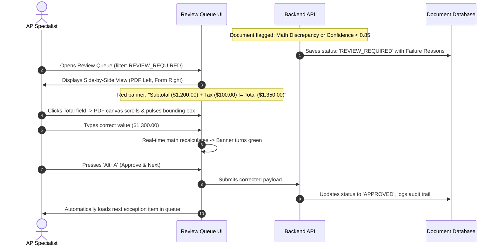

# End-to-End User Workflows & State Transitions
## AI Product Factory — Session 03 — Document Intelligence

## 1. Primary Workflow: The Zero-Touch Happy Path (60-80% Volume)

```mermaid
sequenceDiagram
    autonumber
    actor User as Vendor / Staff
    participant Ingest as Ingestion Service
    participant Extract as Tiered Extraction Engine
    participant Valid as Deterministic Validator
    participant DB as Document Database
    participant UI as Web Dashboard

    User->>Ingest: Uploads PDF / Image Document
    Ingest->>Ingest: Magic Byte Check & SHA-256 Hashing
    Ingest->>Extract: Dispatches Document Stream
    Extract->>Extract: Native Stream Parsing + Spatial Bounding Boxes
    Extract->>Valid: Emits Normalized Candidate Entities
    Valid->>Valid: Checks Math: Subtotal + Tax = Total; LineItem Qty * Price
    Valid->>Valid: Checks Duplicates & Date Sanity
    Note over Valid: 100% Math Valid + Confidence > 0.90
    Valid->>DB: Saves status: 'APPROVED' + Lineage Trail
    DB->>UI: Document appears in 'Approved' Table & Search Index
```

---

## 2. Secondary Workflow: The Exception Triage Path (20-40% Volume)


